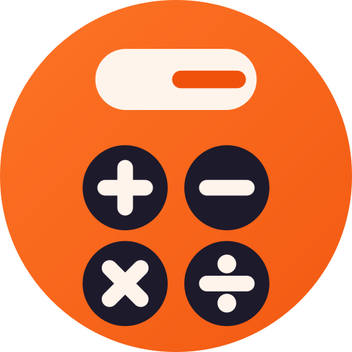
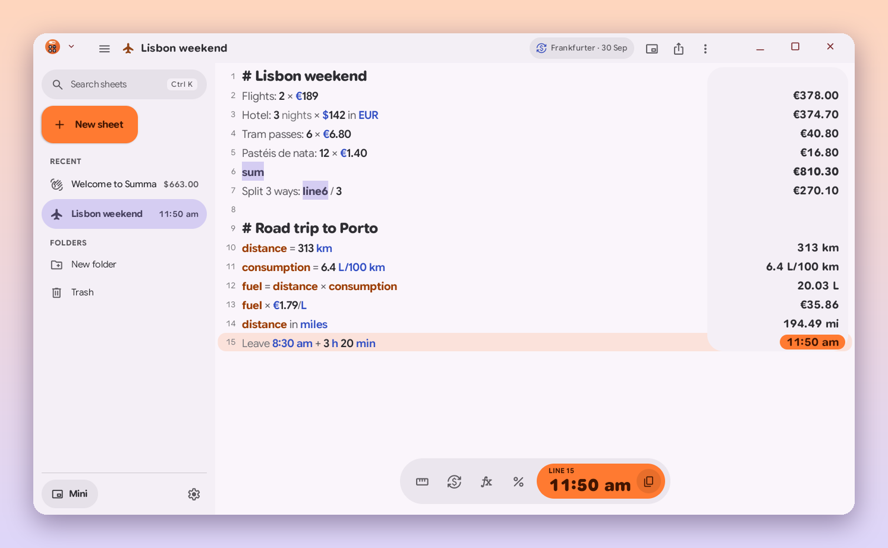
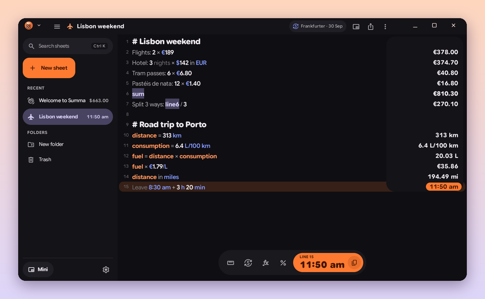
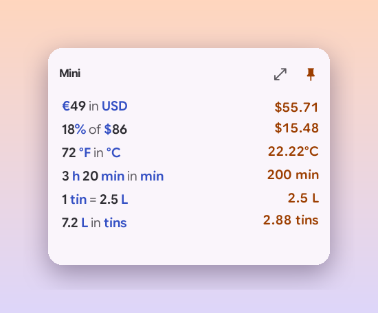
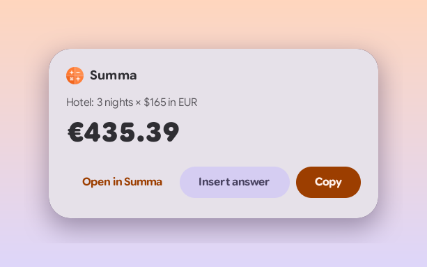
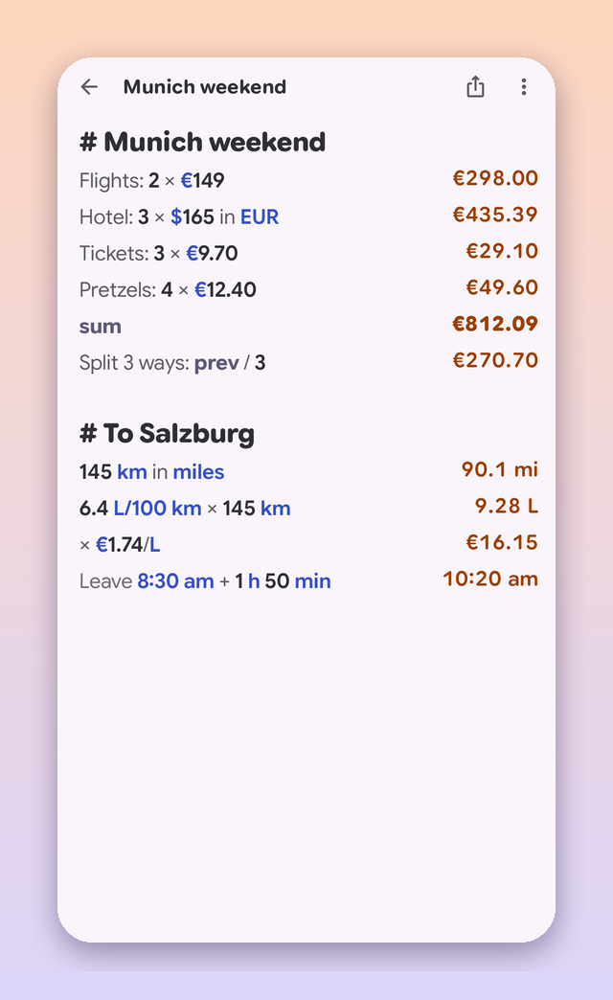

<p align="center">
  
</p>

<h1 align="center">Summa</h1>

<p align="center">
  <b>A notepad calculator for Googlebooks and Android.</b><br>
  Type maths the way you'd say it: <code>Hotel: 3 nights × $142 in EUR</code>. Answers line up on the right as you type.
</p>

<p align="center">
  <a href="../../releases/latest/download/Summa.apk"><b>⬇ Download Summa.apk</b></a>
  &nbsp;·&nbsp; <a href="#install">Install</a>
  &nbsp;·&nbsp; <a href="#what-you-can-type">What you can type</a>
  &nbsp;·&nbsp; <a href="#privacy">Privacy</a>
  &nbsp;·&nbsp; <a href="CHANGELOG.md">What's new</a>
</p>

<p align="center">
  
  
  
  
  
</p>

<p align="center"><sub>A personal hobby project by <a href="https://github.com/kuscher">Alexander Kuscher</a>, proudly developed entirely on a Googlebook.
Not affiliated with or endorsed by any employer (<a href="#about-this-project">more</a>). Inspired by Soulver and Numi.</sub></p>

<p align="center">
  
</p>

## What it does

Summa is a sheet of paper that does the maths. Write a line in plain words and the answer appears
next to it, on the right. Change a number and everything that depends on it updates. Nothing else
gets in the way: no toolbars, no pop-ups, just the sheet.

- **Words around numbers are fine.** `Lunch: $12 + 15% tip`, `Flights: 2 × €189`. Summa skips the
  words it doesn't know and works out the rest. A line that isn't maths simply has no answer.
- **Units and money.** `5 km in miles`, `72 °F in °C`, `€49 in USD`, `6.4 L/100 km in mpg`,
  `$25/hour × 14 hours`, `1 cm in px at 326 ppi`.
- **Percentages, every way.** `20% of $10`, `5% on $30`, `6% off 40 EUR`, `$50 as a % of $100`,
  `20 is 10% of what`, `50 to 75 is what %`.
- **Dates and time zones.** `days until Christmas`, `next friday + 2 weeks`, `8:30 am + 3 h 20 min`,
  `3 pm Munich in Tokyo`, `time in Japan`. Over 6,000 cities, every country and the usual
  abbreviations (PST, CET, IST…), all offline.
- **Live exchange rates** for 166 currencies and metals, refreshed twice a day, with rates built in
  for offline use. Crypto if you want it.
- **Money over time.** `$10,000 at 5% for 10 years compounded monthly`, `interest on €60k at 2.5% for 3 years`,
  `loan of $300k at 6% for 30 years` (→ `$1,798.65/month`), and tax both ways:
  `€1,350 incl 19% VAT`, `€120 without 20% VAT`.
- **Workdays and public holidays.** `workdays until Dec 18`, `5 workdays after Dec 22`,
  `workdays between Oct 1 and Oct 31`, `next holiday`. Summa knows the nationwide holidays of 22
  countries and skips your region's (Settings › Public holidays).
- **Your own names.** `rate = $85/hour`, then `rate × 6.5 hours`. Refer to a line with `line6`,
  the line above with `prev`, and add up a block with `sum`.
- **Your own units and functions.** `1 tin = 2.5 L`, then `7.2 L in tins`; `1 coffee = $4.50`, then
  `$20 in coffees`; `tip(bill) = bill × 18%`, then `tip($86)`. Put them on the **Definitions** sheet
  (Settings › Definitions) and they work in every sheet.
- **Formats.** `255 in hex`, `0.2 as fraction`, `1/3 to 2 dp`, `$490 rounded to nearest hundred`.

<p align="center">
  
  <br><sub>Mortgage, VAT, savings, workdays and a home-made unit, in dark mode.</sub>
</p>

Click an answer to copy it; right-click it to copy the line or convert it to another unit or
currency. As you type, a suggestion for the word appears in grey after the cursor: Tab takes it.
In a desktop window your sheets are listed on the left, newest first (Ctrl+B hides the list). The
Share button copies the sheet with its answers, shares it as text or PDF, exports it (PDF, web
page, CSV, Markdown or text) or prints it. Five colour themes (Tangerine, your wallpaper, Cobalt,
Lime and Berry), light and dark.

## Made for the Googlebook

<p align="center">
  
  &nbsp;&nbsp;
  
  <br><sub>The mini calculator, pinned on top of your other windows, and Calculate on a selection in any app.</sub>
</p>

- **One calm bar on top.** The window's own title bar (app handle, window buttons) is painted to
  match Summa's header just below it, with the sheet title, the mini calculator, Share and ⋮.
- **A mini calculator that stays on top.** Open it from the header or Ctrl+Shift+M and the sheet
  you're on moves into a small window while the big one makes way; its ⤢ button (or Ctrl+Shift+M
  again) brings the big window back, on the same sheet. The Quick Settings tile and the launcher
  open it too, on the sheet you had open last. On Android 17 desktops it stays above your other
  windows (its pin, or Settings).
- **"Calculate" in every app.** Select `€49 in USD` in Chrome or any app, right-click › Calculate,
  and a small card shows the answer with Copy, Insert answer and Open in Summa.
- **A window per sheet.** Right-click a sheet › Open in new window, or use the taskbar's New window.
- **Drag answers** into Docs, Gmail or another sheet. Share text to Summa to start a sheet.
- **Keyboard first**, with every shortcut listed in the system's shortcut helper (Search+/).
- **Handoff:** start a sheet on your phone and carry on at the Googlebook (Android 17).
- **Phones too:** the same quiet sheet with the system keyboard, and your sheets one tap away.

<p align="center">
  
</p>

## What you can type

| You type | Summa answers |
|---|---|
| `Hotel: 3 nights × $142 in EUR` | `€375.17` |
| `$10 for lunch + 15% tip` | `$11.50` |
| `20% discount off $500` | `$400.00` |
| `5 feet 11 inches in cm` | `180.34 cm` |
| `313 km × 6.4 L/100 km` | `20.03 L` |
| `€30/day in €/month` | `€913.11/month` |
| `days until Dec 25` | `86 days` |
| `2:30 pm HKT in Berlin` | `8:30 am` |
| `0x9F31 to decimal` | `40,753` |
| `average of 36, 42, 19 and 81` | `44.5` |
| `loan of $300k at 6% for 30 years` | `$1,798.65/month` |
| `€120 without 20% VAT` | `€100.00` |
| `1 watermelon = 20 lb`, then `100 kg in watermelons` | `11.02 watermelons` |

Over 370 more examples, taken from the Soulver and Numi documentation, run as tests on every build
(`engine/src/test/resources/corpus.tsv`).

## Install

Summa is made for Googlebooks (Googlebook OS, Android 17) and also runs on Android 12 or newer
phones and tablets.

1. On your Googlebook or phone, download **[Summa.apk](../../releases/latest/download/Summa.apk)**
   from the latest release.
2. Open it from Chrome's downloads or the Files app. If Android asks, allow Chrome (or Files) to
   install apps, then tap **Install**.
3. Open **Summa**. It starts with a short welcome sheet and an example trip budget.

To update, install a newer `Summa.apk` over the old one. Your sheets stay.

## Keyboard

| Keys | Does |
|---|---|
| Search+/ | See every shortcut (the system's shortcut helper) |
| Ctrl+N | New sheet |
| Ctrl+Shift+N | New window |
| Ctrl+Shift+M | Swap to the mini calculator, and back |
| Ctrl+K | Search sheets |
| Ctrl+Shift+C | Copy the current line's answer |
| Ctrl+/ | Turn lines into notes (and back) |
| Ctrl+D | Duplicate the line |
| Alt+↑ / Alt+↓ | Move the line up or down |
| Ctrl+\ | Insert `prev` (the answer above) |
| Ctrl+B | Show or hide the sheet list |
| Ctrl+, | Settings |
| Ctrl+P | Print, or save as PDF |
| Tab or → / Esc | Take or hide the grey suggestion after the cursor |

## Privacy

Summa keeps your sheets on your device, in the app's own storage, and Android's backup copies
them to your Google account if you have backup turned on. There are no accounts, ads or analytics.

Summa's only use of the internet is **downloading exchange-rate tables**, at most twice a day and
only while *Settings › Money › Live exchange rates* is on:

- fiat rates from [Frankfurter](https://frankfurter.dev) (central-bank rates, open source), with the
  [European Central Bank](https://www.ecb.europa.eu)'s daily rates as a fallback;
- crypto prices from [CoinGecko](https://www.coingecko.com) only if you turn on *Crypto prices*.

Nothing is ever uploaded: the requests carry no sheet content, account or device ID. The full
[privacy policy](PRIVACY.md) says the same in more words. With the switch
off, Summa uses the rates bundled in the app (and whatever it downloaded last), and works fully offline.
City and time-zone lookups are offline too.

## Made on a Googlebook

Everything here was written, built and tested on a Googlebook, in its built-in Linux Terminal:

- The calculation engine is plain Kotlin, tested with JUnit in the Terminal in a few seconds. A
  2,000-line sheet re-evaluates in about 50 ms on the Googlebook.
- Public holidays are computed from rules (Easter, "last Monday in May", substitute days), so
  there's no holiday data to download.
- The app is Kotlin and Jetpack Compose with Material 3 Expressive, built with Gradle in the same
  Terminal and installed on the Googlebook's own Android over adb.
- Screenshots in this README are the app's own window, captured on the device.

<sub>With a little help from Claude.</sub>

## Build

Needs JDK 21 and the Android SDK (platform 37).

```sh
./gradlew :engine:test            # the calculation engine and its 386 examples, no device needed
./gradlew :app:assembleDebug      # app/build/outputs/apk/debug/app-debug.apk
./gradlew :app:assembleRelease    # signed if ~/.config/summa/keystore.jks and keystore.pass exist
```

Builds you make yourself are signed with your own key, so install them in place of a release
(uninstall first) rather than over it. `./summa` is the development helper (build, install, test
hooks, window captures) for a Googlebook connected over Wireless debugging.
[CLAUDE.md](CLAUDE.md) explains how the code is organised, and [docs/RELEASING.md](docs/RELEASING.md)
how releases are made.

## About this project

Summa is my personal hobby project, made by me, [Alexander Kuscher](https://github.com/kuscher).
It has no affiliation with my employer: my employer didn't make, sponsor, review or endorse it,
and Summa doesn't endorse my employer or its products either. The views, choices and any
mistakes here are mine alone.

Summa is inspired by [Soulver](https://soulver.app) and [Numi](https://numi.app), two lovely Mac
apps that showed how good a notepad calculator can be. It's an independent project and isn't made
by or affiliated with Acqualia (Soulver) or Numi's maker.

— Alexander ([@kuscher](https://github.com/kuscher))

## License

Summa is free software under the [MIT License](LICENSE). It includes the following, listed with
their licences in [THIRD_PARTY_NOTICES.md](THIRD_PARTY_NOTICES.md) and in the app (Settings ›
About › Open-source licences), which also shows the full licence texts:

- **Summa Sans** and **Summa Mono**: Google Sans Flex and Google Sans Code, subset and renamed as
  the [SIL Open Font License 1.1](app/src/main/assets/licenses/OFL-GoogleSans.txt) allows.
- Google's [Material Symbols](https://fonts.google.com/icons) (Apache License 2.0).
- Exchange rates from the European Central Bank (source: ECB), bundled for offline use.
- City data from [GeoNames](https://www.geonames.org) (CC BY 4.0): cities of 100,000+ people and capitals.

It uses Jetpack Compose, AndroidX, Kotlin, kotlinx.coroutines and kotlinx.serialization (Apache
License 2.0, [full text](app/src/main/assets/licenses/Apache-2.0.txt)).

A kit for publishing on Google Play (listing text, graphics, policy answers) is in
[store-submission/](store-submission).
